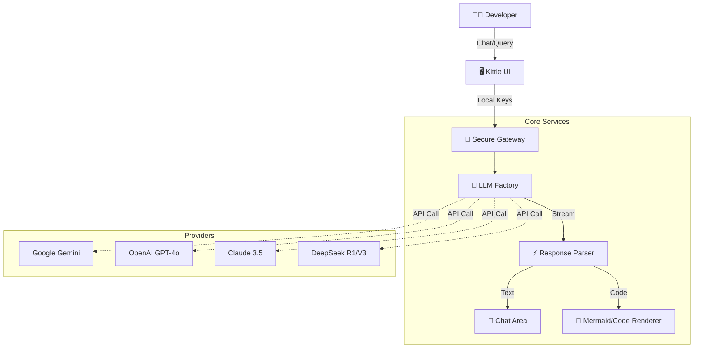

<div align="center">
  <h1>✨ Kittle</h1>
  <p><strong>Your Intelligent Coding Companion</strong></p>
  <p>
    <a href="https://nextjs.org"></a>
    <a href="https://www.typescriptlang.org"></a>
    <a href="https://tailwindcss.com"></a>
    
  </p>
</div>

---

## 🚀 Overview

**Kittle** is a next-generation AI coding assistant designed to live inside your codebase. It bridges the gap between static code analysis and dynamic LLM reasoning, allowing you to "chat" with your project files, generate architecture diagrams, and debug complex logic in real-time.

### 🌟 Key Features

| Feature | Description |
| :--- | :--- |
| **🧠 Deep Reasoning** | Supports **Gemini 2.0/3.0**, **GPT-4o**, **Claude 3.5**, and **DeepSeek R1/V3** via your own API keys. |
| **🎨 Design Mode** | Generate **Mermaid.js** architecture diagrams from your code instantly. Toggle visual/text modes seamlessly. |
| **📂 Context Aware** | Deep integration with your file system. Upload files or select repository subtrees for analysis. |
| **🔒 Privacy First** | API Keys are stored locally (browser storage). Your keys never hit our servers. |
| **⚡ Real-time Stream** | Optimized generic chat interface with 60fps timer and partial rendering. |

---

## 🏗️ Architecture

Kittle operates as a lightweight Next.js client that connects directly to LLM providers via a secure gateway.



---

## 🛠️ Getting Started

Follow these steps to deploy your personal Kittle instance.

### Prerequisites
- **Node.js** (v18+)
- **npm** or **yarn**

### Installation

1.  **Clone the repository**
    ```bash
    git clone https://github.com/your-username/kittle.git
    cd kittle
    ```

2.  **Install dependencies**
    ```bash
    npm install
    # or
    yarn install
    ```

3.  **Run the development server**
    ```bash
    npm run dev
    ```

4.  **Launch**
    Open [http://localhost:3000](http://localhost:3000) in your browser.
    Enter your preferred API Key (Google AI, OpenAI, etc.) in the Gateway to start.

---

## 🤝 Contributing

Contributions are welcome! Please feel free to submit a Pull Request.

<div align="center">
  <sub>Built with ❤️ by the Kittle Team</sub>
</div>
